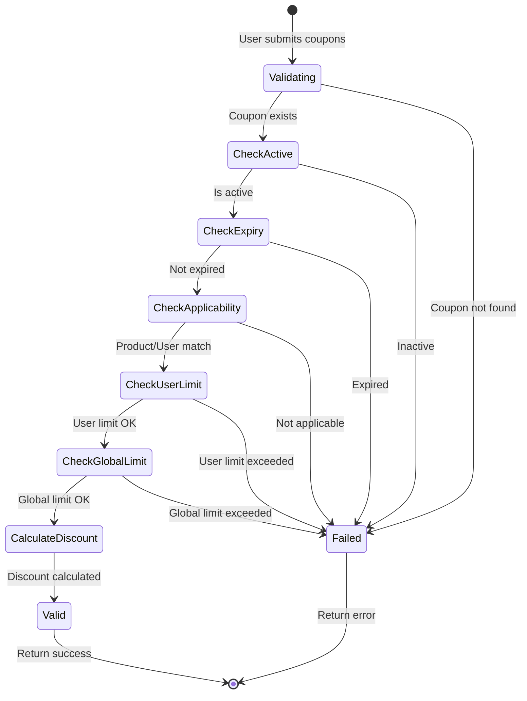
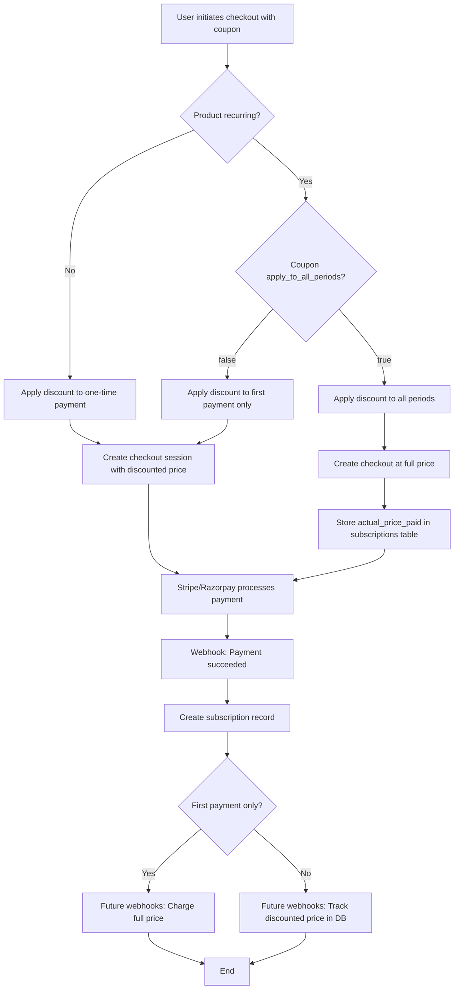
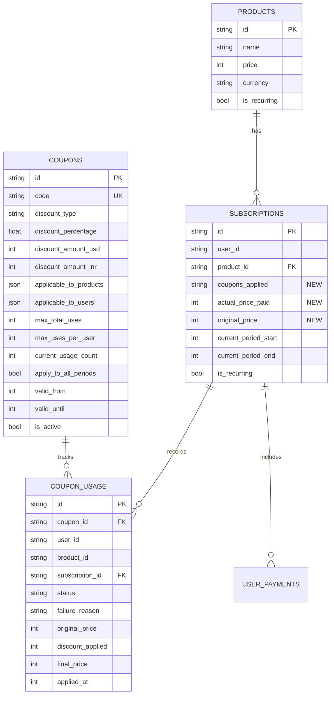

# Coupons/Discount System - Technical Implementation Plan

## Summary (10,000 Feet Technical View)

**Architecture Decision**: Application-level coupon validation with provider-agnostic checkout
- Coupons validated & discount calculated at application layer BEFORE checkout session creation
- Final discounted price passed to Stripe/Razorpay (providers unaware of coupons)
- Stripe: Use `price_data` (dynamic pricing) instead of `price_id`
- Razorpay: Already supports dynamic pricing (no changes needed)

**Database Changes**:
- New table: `paymentservice_coupons` (code, type, value, constraints, limits)
- New table: `paymentservice_coupon_usage` (audit trail, usage tracking)
- Modify: `paymentservice_subscriptions` add `actual_price_paid` + `coupons_applied` columns

**API Flow**:
```
ValidateCoupon(product_id, coupon_codes[]) → {final_price, breakdown}
CreateCheckoutSession(product_id, coupon_codes[]) → {session_url}
                      ↓
                Calculate discount → Create checkout with final_price
```

**Key Technical Decisions**:
- Multiple coupons: Apply sequentially (order matters: percentage → fixed)
- Currency handling: Store discount amount per currency (no external conversion API)
- Subscription discounts: Flag `apply_to_all_periods` determines first-only vs recurring
- Zero-price protection: Allow $0 final price (track in analytics)
- Idempotency: Use `coupon_usage` table to prevent duplicate redemptions

**Concurrency Safety**: 
- Usage limit checks use SQL atomic increment (`UPDATE ... WHERE usage_count < max_uses`)
- Race condition prevention via DB constraints + transaction isolation

**Security**:
- Case-sensitive codes (prevents brute force)
- Parameterized queries (SQL injection prevention)
- Max 5 coupons per checkout (DoS prevention)
- Admin-only coupon CRUD operations

---

## 1. Database Schema Design

### 1.1 New Table: `paymentservice_coupons`

```sql
CREATE TABLE IF NOT EXISTS paymentservice_coupons (
    id TEXT PRIMARY KEY,
    code TEXT UNIQUE NOT NULL,                    -- Case-sensitive, e.g., SAVE20
    discount_type TEXT NOT NULL,                  -- 'percentage' | 'fixed_amount'
    
    -- Discount values (store per currency for fixed_amount)
    discount_percentage REAL,                     -- 0-100 for percentage type
    discount_amount_usd INTEGER,                  -- Amount in cents (fixed_amount)
    discount_amount_inr INTEGER,                  -- Amount in paise (fixed_amount)
    
    -- Applicability
    applicable_to_products TEXT,                  -- JSON array: ["all"] or ["prod_id1", "prod_id2"]
    applicable_to_users TEXT,                     -- JSON array: ["all"] or ["user_id1", "user_id2"]
    
    -- Limits
    max_total_uses INTEGER,                       -- NULL = unlimited
    max_uses_per_user INTEGER,                    -- NULL = unlimited
    current_usage_count INTEGER DEFAULT 0,        -- Atomic counter
    
    -- Subscription-specific
    apply_to_recurring BOOLEAN DEFAULT TRUE,      -- Can apply to recurring products?
    apply_to_all_periods BOOLEAN DEFAULT FALSE,   -- Apply discount to all periods (true) or first only (false)
    
    -- Lifecycle
    valid_from INTEGER NOT NULL,                  -- Unix timestamp
    valid_until INTEGER,                          -- Unix timestamp, NULL = no expiry
    is_active BOOLEAN DEFAULT TRUE,               -- Soft delete flag
    
    -- Audit
    created_by TEXT NOT NULL,                     -- Admin user_id
    created_at TEXT NOT NULL,
    updated_at TEXT NOT NULL
);

CREATE INDEX idx_coupons_code ON paymentservice_coupons(code);
CREATE INDEX idx_coupons_active ON paymentservice_coupons(is_active, valid_from, valid_until);
```

**Schema Notes**:
- `discount_amount_usd/inr`: Store amounts in smallest currency unit (cents/paise)
- `applicable_to_products`: JSON for flexibility (migrate to junction table if >1000 products)
- `current_usage_count`: Incremented atomically via SQL (prevents race conditions)
- `apply_to_all_periods`: Controls recurring subscription discount behavior

### 1.2 New Table: `paymentservice_coupon_usage`

```sql
CREATE TABLE IF NOT EXISTS paymentservice_coupon_usage (
    id TEXT PRIMARY KEY,
    coupon_id TEXT NOT NULL,
    user_id TEXT NOT NULL,
    product_id TEXT NOT NULL,
    subscription_id TEXT,                         -- NULL if failed attempt
    
    -- Outcome
    status TEXT NOT NULL,                         -- 'success' | 'failed'
    failure_reason TEXT,                          -- E.g., "expired", "usage_limit_exceeded"
    
    -- Financial
    original_price INTEGER NOT NULL,
    discount_applied INTEGER NOT NULL,            -- Amount discounted
    final_price INTEGER NOT NULL,
    currency TEXT NOT NULL,
    
    -- Context
    applied_at INTEGER NOT NULL,                  -- Unix timestamp
    created_at TEXT NOT NULL,
    
    FOREIGN KEY (coupon_id) REFERENCES paymentservice_coupons(id),
    FOREIGN KEY (subscription_id) REFERENCES paymentservice_subscriptions(id)
);

CREATE INDEX idx_usage_coupon_user ON paymentservice_coupon_usage(coupon_id, user_id);
CREATE INDEX idx_usage_subscription ON paymentservice_coupon_usage(subscription_id);
CREATE INDEX idx_usage_status ON paymentservice_coupon_usage(status, applied_at);
```

**Purpose**:
- Audit trail for all coupon redemption attempts (success + failure)
- Enforce per-user usage limits
- Analytics foundation (revenue impact tracking)
- Dispute resolution (customer support)

### 1.3 Modified Table: `paymentservice_subscriptions`

```sql
-- Add columns (migration):
ALTER TABLE paymentservice_subscriptions 
    ADD COLUMN actual_price_paid INTEGER;         -- Price after discounts (smallest unit)

ALTER TABLE paymentservice_subscriptions 
    ADD COLUMN coupons_applied TEXT;              -- JSON array of coupon codes used

ALTER TABLE paymentservice_subscriptions 
    ADD COLUMN original_price INTEGER;            -- Product price before discount
```

**Rationale**:
- `actual_price_paid`: Essential for accounting (same product sold at different prices)
- `coupons_applied`: Audit trail (which coupons were used for this subscription)
- `original_price`: Calculate discount percentage for analytics

---

## 2. API Design

### 2.1 New gRPC Methods (proto)

```protobuf
// Add to paymentservice.proto

service PaymentService {
    // ... existing methods ...
    
    // Coupon Management (Admin only)
    rpc CreateCoupon(CreateCouponRequest) returns (CreateCouponResponse);
    rpc UpdateCoupon(UpdateCouponRequest) returns (UpdateCouponResponse);
    rpc DeleteCoupon(DeleteCouponRequest) returns (DeleteCouponResponse);
    rpc ListCoupons(ListCouponsRequest) returns (ListCouponsResponse);
    rpc GetCouponUsageStats(GetCouponUsageStatsRequest) returns (GetCouponUsageStatsResponse);
    
    // Coupon Validation (Public)
    rpc ValidateCoupons(ValidateCouponsRequest) returns (ValidateCouponsResponse);
}

enum DiscountType {
    PERCENTAGE = 0;
    FIXED_AMOUNT = 1;
}

message CreateCouponRequest {
    string code = 1;                              // Case-sensitive
    DiscountType discount_type = 2;
    
    // Discount values
    float discount_percentage = 3;                // 0-100
    int64 discount_amount_usd = 4;                // Cents
    int64 discount_amount_inr = 5;                // Paise
    
    // Applicability
    repeated string applicable_to_product_ids = 6; // ["all"] or specific IDs
    repeated string applicable_to_user_ids = 7;    // ["all"] or specific IDs
    
    // Limits
    int64 max_total_uses = 8;                     // 0 = unlimited
    int64 max_uses_per_user = 9;                  // 0 = unlimited
    
    // Subscription settings
    bool apply_to_recurring = 10;
    bool apply_to_all_periods = 11;
    
    // Lifecycle
    int64 valid_from = 12;                        // Unix timestamp
    int64 valid_until = 13;                       // Unix timestamp, 0 = no expiry
}

message CreateCouponResponse {
    string coupon_id = 1;
    string message = 2;
}

message ValidateCouponsRequest {
    string product_id = 1;
    repeated string coupon_codes = 2;             // Max 5 codes
}

message CouponValidationResult {
    string code = 1;
    bool is_valid = 2;
    string error_message = 3;                     // If invalid
    int64 discount_amount = 4;                    // Calculated discount
}

message ValidateCouponsResponse {
    repeated CouponValidationResult validations = 1;
    int64 original_price = 2;
    int64 total_discount = 3;
    int64 final_price = 4;
    string currency = 5;
}

// Modify existing checkout requests to add coupon support
message CreateStripeCheckoutSessionRequest {
    string product_id = 1;
    repeated string coupon_codes = 2;             // NEW
}

// ... similar for other checkout methods
```

### 2.2 Checkout Flow Modifications

**Before (existing)**:
```
CreateCheckoutSession(product_id)
    → Get product price from DB
    → Pass price_id to Stripe/Razorpay
```

**After (with coupons)**:
```
CreateCheckoutSession(product_id, coupon_codes[])
    → Get product from DB (original_price)
    → ValidateAndCalculateDiscount(product, coupons, user_id)
        → Check: coupon exists, active, not expired
        → Check: user usage limits
        → Check: product applicability
        → Check: global usage limits (atomic)
        → Calculate: discount amount (apply coupons sequentially)
    → final_price = original_price - total_discount
    → CreateProviderCheckoutSession(final_price)  // Use dynamic pricing
    → RecordCouponUsage(status='success')
```

---

## 3. Implementation Approach

### 3.1 Coupon Validation Logic

```go
// Pseudocode for validation logic
func (s *Service) ValidateAndCalculateDiscount(
    productID string, 
    couponCodes []string, 
    userID string,
) (*DiscountResult, error) {
    
    // 1. Input validation
    if len(couponCodes) > 5 {
        return nil, errors.New("max 5 coupons allowed")
    }
    
    product := s.dao.GetProductById(productID)
    currentTime := time.Now().Unix()
    totalDiscount := 0
    remainingPrice := product.Price
    validCoupons := []Coupon{}
    
    // 2. Process each coupon sequentially (order matters)
    for _, code := range couponCodes {
        coupon := s.dao.GetCouponByCode(code)
        
        // 2a. Basic validations
        if coupon == nil {
            recordFailure(code, "invalid_code")
            continue
        }
        if !coupon.IsActive {
            recordFailure(code, "coupon_inactive")
            continue
        }
        if currentTime < coupon.ValidFrom || 
           (coupon.ValidUntil != 0 && currentTime > coupon.ValidUntil) {
            recordFailure(code, "coupon_expired")
            continue
        }
        
        // 2b. Product applicability
        if !isProductApplicable(coupon, productID) {
            recordFailure(code, "product_not_applicable")
            continue
        }
        
        // 2c. User applicability
        if !isUserApplicable(coupon, userID) {
            recordFailure(code, "user_not_applicable")
            continue
        }
        
        // 2d. Recurring product check
        if product.IsRecurring && !coupon.ApplyToRecurring {
            recordFailure(code, "not_applicable_to_recurring")
            continue
        }
        
        // 2e. Usage limit checks (atomic)
        // Check global usage
        if coupon.MaxTotalUses > 0 {
            if !s.dao.IncrementCouponUsageAtomic(coupon.ID) {
                recordFailure(code, "global_usage_limit_exceeded")
                continue
            }
        }
        
        // Check per-user usage
        usageCount := s.dao.GetUserCouponUsageCount(userID, coupon.ID)
        if coupon.MaxUsesPerUser > 0 && usageCount >= coupon.MaxUsesPerUser {
            recordFailure(code, "user_usage_limit_exceeded")
            continue
        }
        
        // 2f. Calculate discount for this coupon
        var discount int64
        if coupon.DiscountType == "percentage" {
            discount = (remainingPrice * coupon.DiscountPercentage) / 100
        } else { // fixed_amount
            if product.Currency == "USD" {
                discount = coupon.DiscountAmountUSD
            } else {
                discount = coupon.DiscountAmountINR
            }
        }
        
        // 2g. Cap discount (cannot exceed remaining price)
        if discount > remainingPrice {
            discount = remainingPrice
        }
        
        remainingPrice -= discount
        totalDiscount += discount
        validCoupons = append(validCoupons, coupon)
    }
    
    finalPrice := product.Price - totalDiscount
    if finalPrice < 0 {
        finalPrice = 0  // Allow zero price
    }
    
    return &DiscountResult{
        OriginalPrice:  product.Price,
        TotalDiscount:  totalDiscount,
        FinalPrice:     finalPrice,
        ValidCoupons:   validCoupons,
    }, nil
}
```

**Atomic Usage Increment (SQL)**:
```sql
-- Prevents race conditions
UPDATE paymentservice_coupons 
SET current_usage_count = current_usage_count + 1
WHERE id = ? 
  AND (max_total_uses = 0 OR current_usage_count < max_total_uses)
RETURNING current_usage_count;

-- If rows affected = 0, limit exceeded
```

### 3.2 Multiple Coupon Application Order

**Approach**: Apply percentage discounts first, then fixed amounts

**Rationale**:
- Most user-friendly (maximizes discount)
- Example: 20% off + $10 off on $100 item
  - Order 1: 20% ($80) → $10 ($70) ✓
  - Order 2: $10 ($90) → 20% ($72) ✗ (worse for user)

**Implementation**:
```go
// Sort coupons: percentage first, then fixed
sort.Slice(coupons, func(i, j int) bool {
    return coupons[i].DiscountType == "percentage" && 
           coupons[j].DiscountType == "fixed_amount"
})
```

---

## 4. Modified Checkout Session Creation

### 4.1 Stripe (One-Time Payment with Coupon)

```go
func (s *PaymentService) CreateStripeCheckoutSession(
    ctx context.Context, 
    userID string, 
    productID string,
    couponCodes []string,  // NEW
) (string, error) {
    
    // 1. Validate coupons and calculate discount
    discountResult, err := s.ValidateAndCalculateDiscount(productID, couponCodes, userID)
    if err != nil {
        return "", err
    }
    
    product, _ := s.dao.GetProductById(productID)
    finalAmount := discountResult.FinalPrice
    
    // 2. Create Stripe session with DYNAMIC PRICING (price_data)
    sessionParams := &stripe.CheckoutSessionParams{
        PaymentMethodTypes: stripe.StringSlice([]string{"card"}),
        LineItems: []*stripe.CheckoutSessionLineItemParams{
            {
                PriceData: &stripe.CheckoutSessionLineItemPriceDataParams{
                    Currency: stripe.String(product.Currency),
                    ProductData: &stripe.CheckoutSessionLineItemPriceDataProductDataParams{
                        Name:        stripe.String(product.Name),
                        Description: stripe.String(product.Description),
                    },
                    UnitAmount: stripe.Int64(finalAmount),  // Discounted price
                },
                Quantity: stripe.Int64(1),
            },
        },
        Mode:       stripe.String("payment"),
        SuccessURL: stripe.String(frontendURL + "/success"),
        CancelURL:  stripe.String(frontendURL + "/cancel"),
        Metadata:   map[string]string{
            "user_id":        userID,
            "product_id":     productID,
            "coupons_applied": strings.Join(couponCodes, ","),  // NEW
            "original_price":  strconv.FormatInt(product.Price, 10),  // NEW
        },
        PaymentIntentData: &stripe.CheckoutSessionPaymentIntentDataParams{
            Metadata: map[string]string{
                "user_id":         userID,
                "product_id":      productID,
                "coupons_applied": strings.Join(couponCodes, ","),
            },
        },
    }
    
    session, err := session.New(sessionParams)
    if err != nil {
        // Rollback coupon usage increments
        s.dao.RollbackCouponUsage(discountResult.ValidCoupons)
        return "", err
    }
    
    // 3. Record coupon usage attempts
    for _, coupon := range discountResult.ValidCoupons {
        s.dao.RecordCouponUsage(userID, productID, coupon.ID, "pending", finalAmount)
    }
    
    return session.URL, nil
}
```

### 4.2 Razorpay (Already supports dynamic pricing)

```go
func (s *PaymentService) CreateRazorpayCheckoutSession(
    ctx context.Context, 
    userID string, 
    productID string,
    couponCodes []string,  // NEW
) (string, int64, string, error) {
    
    // 1. Validate coupons
    discountResult, _ := s.ValidateAndCalculateDiscount(productID, couponCodes, userID)
    
    product, _ := s.dao.GetProductById(productID)
    finalAmount := discountResult.FinalPrice
    
    // 2. Create Razorpay order with final price
    orderParams := map[string]interface{}{
        "amount":   finalAmount,  // Already supports dynamic pricing
        "currency": product.Currency,
        "receipt":  product.RazorpayProductID,
        "notes": map[string]interface{}{
            "user_id":         userID,
            "product_id":      product.ID,
            "coupons_applied": strings.Join(couponCodes, ","),  // NEW
            "original_price":  product.Price,  // NEW
        },
        "payment_capture": 1,
    }
    
    order, err := s.razorpayClient.Order.Create(orderParams, nil)
    // ... rest of implementation
}
```

### 4.3 Subscription Checkout (Recurring Discount Handling)

**Two Scenarios**:

#### Scenario A: First Payment Only (`apply_to_all_periods = false`)
```
Period 1: $80 (discounted from $100)
Period 2: $100 (full price)
Period 3: $100 (full price)
```

**Implementation**: Apply discount only during initial checkout creation

#### Scenario B: All Periods (`apply_to_all_periods = true`)
```
Period 1: $80 (discounted from $100)
Period 2: $80 (discounted)
Period 3: $80 (discounted)
```

**Challenge**: Stripe/Razorpay don't support per-subscription permanent discounts

**Solution Options**:

| Approach | Pros | Cons | Recommendation |
|----------|------|------|----------------|
| **A) Create new product at discounted price** | Simple, provider-native | Product proliferation, hard to track | ❌ Don't use |
| **B) Use provider coupons** | Provider-native | Razorpay lacks API, coupling | ❌ Don't use |
| **C) Store `actual_price_paid` in DB, ignore provider price** | Flexible, audit trail | Provider shows wrong price in dashboard | ✓ **Recommended** |
| **D) Cancel & recreate subscription each period with new price** | Accurate pricing | Complex, breaks subscription continuity | ❌ Don't use |

**Chosen Approach (C) - Implementation**:
```go
// In subscription webhook handler
func (s *Service) handleSubscriptionCharged(event WebhookEvent) {
    subscription := s.dao.GetSubscriptionByID(event.SubscriptionID)
    
    // Check if coupon applies to all periods
    if subscription.CouponsApplied != "" {
        coupons := parseCoupons(subscription.CouponsApplied)
        for _, coupon := range coupons {
            if coupon.ApplyToAllPeriods {
                // Record actual price paid (discounted), not provider's price
                actualPricePaid := calculateDiscountedPrice(subscription.OriginalPrice, coupons)
                s.dao.UpdateSubscriptionPrice(subscription.ID, actualPricePaid)
            }
        }
    }
}
```

**Note**: Provider will charge full price, but application tracks actual price. For accounting accuracy, consider issuing refunds programmatically or using provider credit balance APIs.

---

## 5. Webhook Modifications

### 5.1 Stripe Webhook (`charge.succeeded`)

```go
func (s *Service) handleChargeSucceeded(event stripe.Event) error {
    var charge stripe.Charge
    json.Unmarshal(event.Data.Raw, &charge)
    
    userID := charge.Metadata["user_id"]
    productID := charge.Metadata["product_id"]
    couponsApplied := charge.Metadata["coupons_applied"]  // NEW
    originalPrice := charge.Metadata["original_price"]    // NEW
    
    // Create subscription with coupon tracking
    subscriptionID, _ := s.dao.CreateSubscription(
        eventID,
        userID,
        productID,
        "stripe",
        "", // provider_subscription_id
        "", // provider_customer_id
        "",
        "active",
        periodStart,
        periodEnd,
        false,
        product.IsRecurring,
    )
    
    // Update with coupon info (NEW)
    s.dao.UpdateSubscriptionCouponInfo(
        subscriptionID,
        couponsApplied,
        charge.Amount,        // actual_price_paid
        parseOriginalPrice(originalPrice),
    )
    
    // Update coupon usage status: pending → success (NEW)
    if couponsApplied != "" {
        s.dao.UpdateCouponUsageStatus(userID, productID, subscriptionID, "success")
    }
    
    // ... rest of existing logic
}
```

### 5.2 Razorpay Webhook (`payment.captured`)

Similar modifications to track `coupons_applied` from notes metadata.

---

## 6. DAO Interface Updates

```go
// Add to dao/dao.go
type DAO interface {
    // ... existing methods ...
    
    // Coupon methods
    CreateCoupon(coupon *Coupon) (string, error)
    UpdateCoupon(couponID string, coupon *Coupon) error
    DeleteCoupon(couponID string) error  // Soft delete
    GetCouponByCode(code string) (*Coupon, error)
    ListCoupons(filters CouponFilters) ([]*Coupon, error)
    
    // Coupon usage
    IncrementCouponUsageAtomic(couponID string) bool
    RollbackCouponUsage(coupons []*Coupon) error
    GetUserCouponUsageCount(userID, couponID string) int64
    RecordCouponUsage(usage *CouponUsage) error
    UpdateCouponUsageStatus(userID, productID, subscriptionID, status string) error
    GetCouponUsageStats(couponID string) (*CouponStats, error)
    
    // Subscription updates
    UpdateSubscriptionCouponInfo(subscriptionID, couponsApplied string, actualPrice, originalPrice int64) error
}
```

---

## 7. Security Considerations

### 7.1 Input Validation

```go
// Validate coupon code format
func validateCouponCode(code string) error {
    if len(code) < 3 || len(code) > 50 {
        return errors.New("coupon code must be 3-50 characters")
    }
    if !regexp.MustCompile(`^[A-Z0-9_-]+$`).MatchString(code) {
        return errors.New("coupon code contains invalid characters")
    }
    return nil
}

// Validate discount values
func validateDiscount(discountType string, percentage float64, amountUSD, amountINR int64) error {
    if discountType == "percentage" {
        if percentage < 0 || percentage > 100 {
            return errors.New("discount percentage must be 0-100")
        }
    } else {
        if amountUSD < 0 || amountINR < 0 {
            return errors.New("discount amount cannot be negative")
        }
        if amountUSD > 1000000 || amountINR > 100000000 {  // $10k, ₹10L
            return errors.New("discount amount exceeds maximum")
        }
    }
    return nil
}
```

### 7.2 SQL Injection Prevention

- Use parameterized queries (already implemented via `sqlx`)
- Never concatenate user input into SQL strings

### 7.3 Rate Limiting

```go
// Add to API layer
type CouponValidator struct {
    rateLimiter *rate.Limiter  // 10 validations per minute per user
}

func (v *CouponValidator) ValidateCoupons(userID string, codes []string) error {
    if !v.rateLimiter.Allow(userID) {
        return status.Error(codes.ResourceExhausted, "rate limit exceeded")
    }
    // ... validation logic
}
```

### 7.4 Authorization

```go
// Admin-only operations
func (s *PaymentServiceAPI) CreateCoupon(ctx context.Context, req *pb.CreateCouponRequest) (*pb.CreateCouponResponse, error) {
    userID, _ := auth.GetUserIDFromContext(ctx)
    
    // Check admin role (implement based on your auth system)
    if !s.authService.IsAdmin(userID) {
        return nil, status.Error(codes.PermissionDenied, "admin access required")
    }
    
    // ... create coupon
}
```

---

## 8. Test Plan

### 8.1 Unit Tests

```go
// Test: Multiple coupon application order
func TestCouponApplicationOrder(t *testing.T) {
    service := setupTestService(t)
    
    // Setup: Product $100, Coupon1: 20% off, Coupon2: $10 off
    product := createTestProduct(10000, "USD")  // $100
    coupon1 := createTestCoupon("PERCENT20", "percentage", 20.0, 0, 0)
    coupon2 := createTestCoupon("FIXED10", "fixed_amount", 0, 1000, 0)
    
    // Act
    result, _ := service.ValidateAndCalculateDiscount(product.ID, []string{"PERCENT20", "FIXED10"}, "user123")
    
    // Assert
    assert.Equal(t, 10000, result.OriginalPrice)   // $100
    assert.Equal(t, 3000, result.TotalDiscount)    // $30 (20% of $100 = $20, then $10)
    assert.Equal(t, 7000, result.FinalPrice)       // $70
}

// Test: Expired coupon
func TestExpiredCoupon(t *testing.T) {
    service := setupTestService(t)
    
    // Setup: Coupon expired yesterday
    coupon := createTestCoupon("EXPIRED", "percentage", 10.0, 0, 0)
    coupon.ValidUntil = time.Now().Add(-24 * time.Hour).Unix()
    service.dao.CreateCoupon(coupon)
    
    // Act
    result, err := service.ValidateAndCalculateDiscount(productID, []string{"EXPIRED"}, userID)
    
    // Assert
    assert.Error(t, err)
    assert.Contains(t, err.Error(), "coupon_expired")
}

// Test: Usage limit (atomic)
func TestCouponUsageLimitConcurrency(t *testing.T) {
    service := setupTestService(t)
    
    // Setup: Coupon with max 5 uses
    coupon := createTestCoupon("LIMITED", "percentage", 10.0, 0, 0)
    coupon.MaxTotalUses = 5
    service.dao.CreateCoupon(coupon)
    
    // Act: 10 concurrent redemptions
    var wg sync.WaitGroup
    successCount := atomic.Int32{}
    for i := 0; i < 10; i++ {
        wg.Add(1)
        go func(userNum int) {
            defer wg.Done()
            userID := fmt.Sprintf("user%d", userNum)
            _, err := service.ValidateAndCalculateDiscount(productID, []string{"LIMITED"}, userID)
            if err == nil {
                successCount.Add(1)
            }
        }(i)
    }
    wg.Wait()
    
    // Assert: Only 5 successful redemptions
    assert.Equal(t, int32(5), successCount.Load())
}

// Test: Allow zero final price
func TestAllowZeroPrice(t *testing.T) {
    service := setupTestService(t)
    
    // Setup: Product $10, Coupon $20 off
    product := createTestProduct(1000, "USD")  // $10
    coupon := createTestCoupon("BIG20", "fixed_amount", 0, 2000, 0)
    
    // Act
    result, _ := service.ValidateAndCalculateDiscount(product.ID, []string{"BIG20"}, userID)
    
    // Assert
    assert.Equal(t, int64(0), result.FinalPrice)  // Should be $0, not error
}

// Test: Product-specific coupon
func TestProductSpecificCoupon(t *testing.T) {
    service := setupTestService(t)
    
    // Setup: Coupon only for product A
    productA := createTestProduct(5000, "USD")
    productB := createTestProduct(5000, "USD")
    coupon := createTestCoupon("PRODUCTA", "percentage", 10.0, 0, 0)
    coupon.ApplicableToProducts = fmt.Sprintf(`["%s"]`, productA.ID)
    
    // Act
    resultA, errA := service.ValidateAndCalculateDiscount(productA.ID, []string{"PRODUCTA"}, userID)
    resultB, errB := service.ValidateAndCalculateDiscount(productB.ID, []string{"PRODUCTA"}, userID)
    
    // Assert
    assert.NoError(t, errA)
    assert.Equal(t, int64(4500), resultA.FinalPrice)  // 10% off
    
    assert.Error(t, errB)
    assert.Contains(t, errB.Error(), "product_not_applicable")
}

// Test: Prevent duplicate usage per user
func TestPreventDuplicateUsage(t *testing.T) {
    service := setupTestService(t)
    
    // Setup: Coupon with max 1 use per user
    coupon := createTestCoupon("ONCE", "percentage", 10.0, 0, 0)
    coupon.MaxUsesPerUser = 1
    
    // Act: First usage
    _, err1 := service.ValidateAndCalculateDiscount(productID, []string{"ONCE"}, userID)
    service.dao.RecordCouponUsage(&CouponUsage{UserID: userID, CouponID: coupon.ID, Status: "success"})
    
    // Act: Second usage
    _, err2 := service.ValidateAndCalculateDiscount(productID, []string{"ONCE"}, userID)
    
    // Assert
    assert.NoError(t, err1)
    assert.Error(t, err2)
    assert.Contains(t, err2.Error(), "user_usage_limit_exceeded")
}
```

### 8.2 Integration Tests

```go
// Test: Full checkout flow with coupon
func TestStripeCheckoutWithCoupon(t *testing.T) {
    service := setupTestService(t)
    
    // Setup
    product := createTestProduct(10000, "USD")
    coupon := createTestCoupon("SAVE20", "percentage", 20.0, 0, 0)
    
    // Act: Create checkout session
    sessionURL, err := service.CreateStripeCheckoutSession(ctx, userID, product.ID, []string{"SAVE20"})
    
    // Assert
    assert.NoError(t, err)
    assert.NotEmpty(t, sessionURL)
    
    // Verify coupon usage recorded
    usage, _ := service.dao.GetCouponUsage(userID, product.ID)
    assert.Equal(t, "pending", usage.Status)
    assert.Equal(t, int64(2000), usage.DiscountApplied)
    assert.Equal(t, int64(8000), usage.FinalPrice)
}

// Test: Webhook processing with coupon metadata
func TestWebhookChargeSucceededWithCoupon(t *testing.T) {
    service := setupTestService(t)
    
    // Setup: Simulate Stripe charge.succeeded webhook
    event := createMockStripeEvent("charge.succeeded", map[string]string{
        "user_id":         userID,
        "product_id":      productID,
        "coupons_applied": "SAVE20,FIXED10",
        "original_price":  "10000",
    })
    
    // Act
    err := service.handleChargeSucceeded(ctx, event)
    
    // Assert
    assert.NoError(t, err)
    
    // Verify subscription created with coupon info
    subscription, _ := service.dao.GetSubscriptionByUserIDAndProductID(userID, productID)
    assert.Equal(t, "SAVE20,FIXED10", subscription.CouponsApplied)
    assert.Equal(t, int64(7000), subscription.ActualPricePaid)
    assert.Equal(t, int64(10000), subscription.OriginalPrice)
    
    // Verify coupon usage updated to success
    usages, _ := service.dao.GetCouponUsageBySubscription(subscription.ID)
    for _, usage := range usages {
        assert.Equal(t, "success", usage.Status)
    }
}
```

### 8.3 Test Data Setup

```sql
-- Test data for coupons (seed file)
INSERT INTO paymentservice_coupons (id, code, discount_type, discount_percentage, discount_amount_usd, discount_amount_inr, applicable_to_products, applicable_to_users, max_total_uses, max_uses_per_user, apply_to_recurring, apply_to_all_periods, valid_from, valid_until, is_active, created_by, created_at, updated_at)
VALUES
    ('coupon_1', 'SAVE20', 'percentage', 20.0, 0, 0, '["all"]', '["all"]', 0, 0, true, false, strftime('%s', 'now'), 0, true, 'admin_user', datetime('now'), datetime('now')),
    ('coupon_2', 'FIXED10USD', 'fixed_amount', 0, 1000, 0, '["all"]', '["all"]', 100, 1, true, false, strftime('%s', 'now'), strftime('%s', 'now', '+30 days'), true, 'admin_user', datetime('now'), datetime('now')),
    ('coupon_3', 'EXPIRED', 'percentage', 50.0, 0, 0, '["all"]', '["all"]', 0, 0, true, false, strftime('%s', 'now', '-60 days'), strftime('%s', 'now', '-30 days'), true, 'admin_user', datetime('now'), datetime('now')),
    ('coupon_4', 'FIRSTONLY', 'percentage', 100.0, 0, 0, '["all"]', '["all"]', 1, 1, true, false, strftime('%s', 'now'), 0, true, 'admin_user', datetime('now'), datetime('now'));
```

---

## 9. Decision Log

| Decision Point | Options Considered | Choice Made | Rationale | Date |
|----------------|-------------------|-------------|-----------|------|
| **Coupon Location** | A) Provider-level (Stripe/Razorpay coupons)<br>B) Application-level | **B) Application-level** | Razorpay lacks coupon API; unified logic across providers | _[PENDING]_ |
| **Multiple Coupons** | A) One coupon only<br>B) Multiple coupons (sequential) | **B) Multiple coupons** | User requirement; apply percentage → fixed order | _[PENDING]_ |
| **Recurring Discount** | A) Create new product<br>B) Provider coupons<br>C) Track in DB, ignore provider | **C) Track in DB** | Flexibility; audit trail; no product proliferation | _[PENDING]_ |
| **Currency Handling** | A) Store per currency<br>B) Dynamic conversion via API | **A) Store per currency** | Avoid external API dependency; predictable pricing | _[PENDING]_ |
| **Zero Price** | A) Block (throw error)<br>B) Allow | **B) Allow** | User requirement; track for analytics | _[PENDING]_ |
| **Usage Tracking** | A) Success only<br>B) Success + failures | **B) Success + failures** | Comprehensive audit; fraud detection; analytics | _[PENDING]_ |
| **Stripe Pricing** | A) Keep price_id<br>B) Use price_data (dynamic) | **B) Use price_data** | Supports discounted prices without creating new products | _[PENDING]_ |

**Instructions**: Fill in "Date" column when decision is finalized. Add "Reason" column if choice changes.

---

## 10. Migration Strategy

### 10.1 Database Migration (SQLite)

```sql
-- Migration file: 2_add_coupons.up.sql

-- Step 1: Create coupons table
CREATE TABLE IF NOT EXISTS paymentservice_coupons (
    id TEXT PRIMARY KEY,
    code TEXT UNIQUE NOT NULL,
    discount_type TEXT NOT NULL CHECK(discount_type IN ('percentage', 'fixed_amount')),
    discount_percentage REAL CHECK(discount_percentage >= 0 AND discount_percentage <= 100),
    discount_amount_usd INTEGER CHECK(discount_amount_usd >= 0),
    discount_amount_inr INTEGER CHECK(discount_amount_inr >= 0),
    applicable_to_products TEXT NOT NULL DEFAULT '["all"]',
    applicable_to_users TEXT NOT NULL DEFAULT '["all"]',
    max_total_uses INTEGER DEFAULT 0,
    max_uses_per_user INTEGER DEFAULT 0,
    current_usage_count INTEGER DEFAULT 0 CHECK(current_usage_count >= 0),
    apply_to_recurring BOOLEAN DEFAULT TRUE,
    apply_to_all_periods BOOLEAN DEFAULT FALSE,
    valid_from INTEGER NOT NULL,
    valid_until INTEGER DEFAULT 0,
    is_active BOOLEAN DEFAULT TRUE,
    created_by TEXT NOT NULL,
    created_at TEXT NOT NULL,
    updated_at TEXT NOT NULL
);

CREATE INDEX idx_coupons_code ON paymentservice_coupons(code);
CREATE INDEX idx_coupons_active ON paymentservice_coupons(is_active, valid_from, valid_until);

-- Step 2: Create coupon usage table
CREATE TABLE IF NOT EXISTS paymentservice_coupon_usage (
    id TEXT PRIMARY KEY,
    coupon_id TEXT NOT NULL,
    user_id TEXT NOT NULL,
    product_id TEXT NOT NULL,
    subscription_id TEXT,
    status TEXT NOT NULL CHECK(status IN ('success', 'failed', 'pending')),
    failure_reason TEXT,
    original_price INTEGER NOT NULL,
    discount_applied INTEGER NOT NULL,
    final_price INTEGER NOT NULL,
    currency TEXT NOT NULL,
    applied_at INTEGER NOT NULL,
    created_at TEXT NOT NULL,
    FOREIGN KEY (coupon_id) REFERENCES paymentservice_coupons(id),
    FOREIGN KEY (subscription_id) REFERENCES paymentservice_subscriptions(id)
);

CREATE INDEX idx_usage_coupon_user ON paymentservice_coupon_usage(coupon_id, user_id);
CREATE INDEX idx_usage_subscription ON paymentservice_coupon_usage(subscription_id);
CREATE INDEX idx_usage_status ON paymentservice_coupon_usage(status, applied_at);

-- Step 3: Alter subscriptions table (SQLite doesn't support ALTER TABLE ADD COLUMN with constraints directly)
-- Create new table with additional columns
CREATE TABLE paymentservice_subscriptions_new (
    id TEXT PRIMARY KEY,
    event_id TEXT UNIQUE NOT NULL,
    user_id TEXT NOT NULL,
    product_id TEXT NOT NULL,
    provider TEXT NOT NULL,
    provider_subscription_id TEXT,
    provider_subscription_status TEXT,
    provider_customer_id TEXT,
    status TEXT NOT NULL,
    current_period_start INTEGER NOT NULL,
    current_period_end INTEGER NOT NULL,
    cancel_at_period_end BOOLEAN DEFAULT FALSE,
    created_at TEXT NOT NULL,
    updated_at TEXT NOT NULL,
    canceled_at INTEGER,
    is_recurring BOOLEAN DEFAULT FALSE,
    actual_price_paid INTEGER,           -- NEW
    coupons_applied TEXT,                -- NEW (JSON array of codes)
    original_price INTEGER,              -- NEW
    FOREIGN KEY (product_id) REFERENCES paymentservice_products(id)
);

-- Copy existing data
INSERT INTO paymentservice_subscriptions_new
SELECT 
    id, event_id, user_id, product_id, provider, provider_subscription_id, 
    provider_subscription_status, provider_customer_id, status, 
    current_period_start, current_period_end, cancel_at_period_end, 
    created_at, updated_at, canceled_at, is_recurring,
    NULL as actual_price_paid,  -- Default for existing records
    NULL as coupons_applied,    -- Default for existing records
    NULL as original_price      -- Default for existing records
FROM paymentservice_subscriptions;

-- Drop old table and rename new
DROP TABLE paymentservice_subscriptions;
ALTER TABLE paymentservice_subscriptions_new RENAME TO paymentservice_subscriptions;

-- Recreate indexes
-- (Add any indexes that existed on old table)
```

### 10.2 Rollback Migration

```sql
-- Migration file: 2_add_coupons.down.sql

-- Drop coupon tables
DROP TABLE IF EXISTS paymentservice_coupon_usage;
DROP TABLE IF EXISTS paymentservice_coupons;

-- Revert subscriptions table (recreate without new columns)
-- (Implementation similar to .up.sql but in reverse)
```

### 10.3 Deployment Steps

1. **Backup database** (critical!)
2. Run migration: `go run ./backend/paymentservice/dao/migrate.go up`
3. Deploy new code (feature flag: `ENABLE_COUPONS=false`)
4. Test coupon CRUD operations in staging
5. Enable feature flag: `ENABLE_COUPONS=true`
6. Monitor logs for errors
7. If issues: rollback migration and disable feature

---

## 11. Monitoring & Analytics

### 11.1 Metrics to Track

```go
// Prometheus metrics
var (
    couponValidationCount = prometheus.NewCounterVec(
        prometheus.CounterOpts{
            Name: "coupon_validations_total",
            Help: "Total coupon validation attempts",
        },
        []string{"status", "failure_reason"},  // status: success/failed
    )
    
    couponRedemptionValue = prometheus.NewHistogramVec(
        prometheus.HistogramOpts{
            Name: "coupon_discount_amount_cents",
            Help: "Discount amount applied",
            Buckets: []float64{100, 500, 1000, 5000, 10000, 50000},
        },
        []string{"currency", "discount_type"},
    )
    
    couponUsageLimitHit = prometheus.NewCounterVec(
        prometheus.CounterOpts{
            Name: "coupon_limit_exceeded_total",
            Help: "Coupon usage limit exceeded events",
        },
        []string{"limit_type"},  // limit_type: global/per_user
    )
)
```

### 11.2 Analytics Queries

```sql
-- Top 10 coupons by redemption count
SELECT 
    c.code,
    COUNT(u.id) as redemption_count,
    SUM(u.discount_applied) / 100.0 as total_discount_usd,
    AVG(u.discount_applied) / 100.0 as avg_discount_usd
FROM paymentservice_coupons c
JOIN paymentservice_coupon_usage u ON c.id = u.coupon_id
WHERE u.status = 'success'
GROUP BY c.id, c.code
ORDER BY redemption_count DESC
LIMIT 10;

-- Revenue impact (discounted vs original)
SELECT 
    DATE(datetime(applied_at, 'unixepoch')) as date,
    SUM(original_price) / 100.0 as original_revenue_usd,
    SUM(final_price) / 100.0 as actual_revenue_usd,
    SUM(discount_applied) / 100.0 as total_discount_usd,
    (SUM(discount_applied) * 100.0 / SUM(original_price)) as discount_rate_percent
FROM paymentservice_coupon_usage
WHERE status = 'success' AND currency = 'USD'
GROUP BY DATE(datetime(applied_at, 'unixepoch'))
ORDER BY date DESC;

-- Failed redemption reasons
SELECT 
    failure_reason,
    COUNT(*) as failure_count,
    COUNT(*) * 100.0 / (SELECT COUNT(*) FROM paymentservice_coupon_usage WHERE status = 'failed') as percentage
FROM paymentservice_coupon_usage
WHERE status = 'failed'
GROUP BY failure_reason
ORDER BY failure_count DESC;
```

---

## 12. API Request/Response Examples

### 12.1 Create Coupon (Admin)

**Request**:
```json
{
    "code": "SUMMER2025",
    "discount_type": "PERCENTAGE",
    "discount_percentage": 25.0,
    "applicable_to_product_ids": ["all"],
    "applicable_to_user_ids": ["all"],
    "max_total_uses": 1000,
    "max_uses_per_user": 1,
    "apply_to_recurring": true,
    "apply_to_all_periods": false,
    "valid_from": 1735689600,
    "valid_until": 1743552000
}
```

**Response**:
```json
{
    "coupon_id": "coupon_abc123",
    "message": "Coupon created successfully"
}
```

### 12.2 Validate Coupons (Public)

**Request**:
```json
{
    "product_id": "prod_xyz789",
    "coupon_codes": ["SUMMER2025", "FIXED10"]
}
```

**Response**:
```json
{
    "validations": [
        {
            "code": "SUMMER2025",
            "is_valid": true,
            "error_message": "",
            "discount_amount": 2500
        },
        {
            "code": "FIXED10",
            "is_valid": true,
            "error_message": "",
            "discount_amount": 1000
        }
    ],
    "original_price": 10000,
    "total_discount": 3500,
    "final_price": 6500,
    "currency": "USD"
}
```

### 12.3 Create Checkout with Coupons

**Request**:
```json
{
    "product_id": "prod_xyz789",
    "coupon_codes": ["SUMMER2025", "FIXED10"]
}
```

**Response**:
```json
{
    "session_url": "https://checkout.stripe.com/c/pay/cs_test_..."
}
```

---

## 13. ASCII Art - System Flow

```
┌─────────────────────────────────────────────────────────────────────┐
│                    COUPON VALIDATION & CHECKOUT FLOW                │
└─────────────────────────────────────────────────────────────────────┘

 [Client]                [API Layer]           [Service]         [Database]
    │                         │                     │                 │
    │  ValidateCoupons()      │                     │                 │
    ├────────────────────────>│                     │                 │
    │  {product_id, coupons}  │                     │                 │
    │                         │  GetProduct()       │                 │
    │                         ├────────────────────>│                 │
    │                         │                     │  SELECT product │
    │                         │                     ├────────────────>│
    │                         │                     │<────────────────┤
    │                         │                     │                 │
    │                         │  FOR EACH coupon:   │                 │
    │                         │  ┌─────────────────────────────────┐ │
    │                         │  │ 1. Check active & not expired   │ │
    │                         │  │ 2. Check product applicability  │ │
    │                         │  │ 3. Check user limits            │ │
    │                         │  │ 4. Check global limits (ATOMIC) │ │
    │                         │  │ 5. Calculate discount           │ │
    │                         │  └─────────────────────────────────┘ │
    │                         │                     │  Atomic UPDATE  │
    │                         │                     ├────────────────>│
    │                         │                     │  (usage_count++)│
    │                         │                     │<────────────────┤
    │                         │<────────────────────┤                 │
    │<────────────────────────┤  {final_price, breakdown}            │
    │                         │                     │                 │
    │  CreateCheckoutSession()│                     │                 │
    ├────────────────────────>│                     │                 │
    │  {product_id, coupons}  │                     │                 │
    │                         │  Re-validate & calc │                 │
    │                         ├────────────────────>│                 │
    │                         │                     │                 │
    │                         │  CreateStripeSession│                 │
    │                         │  (with final_price) │                 │
    │                         │<────────────────────┤                 │
    │                         │                     │                 │
    │                         │  RecordUsage()      │                 │
    │                         │  (status='pending') │                 │
    │                         ├────────────────────>│  INSERT usage   │
    │                         │                     ├────────────────>│
    │<────────────────────────┤  {session_url}      │                 │
    │                         │                     │                 │
    │  [User completes payment on Stripe/Razorpay]  │                 │
    │                         │                     │                 │
    │  Webhook: charge.succeeded                    │                 │
    ├──────────────────────────────────────────────>│                 │
    │                         │  CreateSubscription │                 │
    │                         │  + Update usage     │                 │
    │                         │  (status='success') │                 │
    │                         ├────────────────────>│  INSERT + UPDATE│
    │                         │                     ├────────────────>│
    │<─────────────────────── ACK ─────────────────┤                 │


Legend:
  ────>  Synchronous call
  ═══>   Asynchronous event
  [  ]   System component
  { }    Data payload
```

---

## 14. Mermaid Diagrams

### 14.1 Coupon Validation State Machine



### 14.2 Subscription Discount Flow



### 14.3 Database Entity Relationship



---

## 15. Implementation Checklist

### Phase 1: Database & Models (Week 1)
- [ ] Create migration file `2_add_coupons.up.sql`
- [ ] Run migration on local SQLite
- [ ] Add `Coupon` model to `dao/models.go`
- [ ] Add `CouponUsage` model to `dao/models.go`
- [ ] Update `Subscription` model with new fields
- [ ] Implement DAO methods for coupons (CRUD)
- [ ] Implement DAO methods for coupon usage tracking
- [ ] Write unit tests for DAO layer

### Phase 2: Service Layer (Week 2)
- [ ] Implement `ValidateAndCalculateDiscount()` function
- [ ] Implement `IncrementCouponUsageAtomic()` function
- [ ] Implement multiple coupon application logic (ordering)
- [ ] Implement coupon applicability checks (product/user)
- [ ] Implement usage limit checks (global/per-user)
- [ ] Add error handling with specific error codes
- [ ] Write unit tests for service layer (all scenarios)

### Phase 3: Modified Checkout Flow (Week 3)
- [ ] Modify `CreateStripeCheckoutSession()` to accept coupons
- [ ] Modify `CreateRazorpayCheckoutSession()` to accept coupons
- [ ] Modify `CreateStripeSubscriptionCheckoutSession()` to accept coupons
- [ ] Modify `CreateRazorpaySubscriptionCheckoutSession()` to accept coupons
- [ ] Update Stripe checkout to use `price_data` instead of `price_id`
- [ ] Add coupon metadata to Stripe/Razorpay sessions
- [ ] Implement rollback logic for failed checkouts
- [ ] Write integration tests for checkout flows

### Phase 4: Webhook Updates (Week 3)
- [ ] Modify `handleChargeSucceeded()` to extract coupon metadata
- [ ] Modify `handleRazorpayPaymentCaptured()` to extract coupon metadata
- [ ] Update subscription creation to include coupon info
- [ ] Implement coupon usage status update (pending → success)
- [ ] Handle recurring subscription discounts (all periods)
- [ ] Write tests for webhook handlers

### Phase 5: API Layer (Week 4)
- [ ] Update proto file with new messages/enums
- [ ] Run `go generate` to regenerate proto code
- [ ] Implement `CreateCoupon()` API handler (admin auth)
- [ ] Implement `UpdateCoupon()` API handler (admin auth)
- [ ] Implement `DeleteCoupon()` API handler (admin auth)
- [ ] Implement `ListCoupons()` API handler (admin auth)
- [ ] Implement `ValidateCoupons()` API handler (public)
- [ ] Implement `GetCouponUsageStats()` API handler (admin auth)
- [ ] Add input validation for all handlers
- [ ] Add rate limiting for validation endpoint
- [ ] Write API tests

### Phase 6: Security & Testing (Week 5)
- [ ] Implement admin authorization checks
- [ ] Add SQL injection tests (verify parameterized queries)
- [ ] Add concurrency tests for usage limits
- [ ] Add performance tests (validate 1000 coupons)
- [ ] Security audit: input validation
- [ ] Security audit: rate limiting
- [ ] Load test: concurrent redemptions

### Phase 7: Frontend Integration (Week 6)
- [ ] Generate TypeScript proto files
- [ ] Create coupon validation UI component
- [ ] Create coupon input field on checkout page
- [ ] Display discount breakdown before payment
- [ ] Handle validation errors (expired, limit exceeded, etc.)
- [ ] Add admin coupon management UI (CRUD operations)
- [ ] Add coupon usage analytics dashboard

### Phase 8: Monitoring & Deployment (Week 7)
- [ ] Add Prometheus metrics
- [ ] Add logging for coupon events
- [ ] Create analytics queries
- [ ] Document API endpoints (OpenAPI/Swagger)
- [ ] Create runbook for common issues
- [ ] Deploy to staging with feature flag
- [ ] End-to-end testing on staging
- [ ] Deploy to production
- [ ] Monitor for 48 hours

---

## 16. Potential Issues & Mitigations

| Issue | Impact | Mitigation | Priority |
|-------|--------|------------|----------|
| **Race condition on usage limits** | Multiple users exceed limit | Use atomic SQL updates with WHERE clause | 🔴 High |
| **Stripe price mismatch in dashboard** | Accounting confusion | Document that DB is source of truth; use `actual_price_paid` | 🟡 Medium |
| **Coupon code enumeration attack** | Unauthorized discounts | Case-sensitive codes; rate limiting; no hints on failures | 🟡 Medium |
| **Decimal rounding errors** | Incorrect discount amounts | Store all prices in smallest unit (cents/paise); use integer math | 🔴 High |
| **Expired coupon still in checkout flow** | User confusion | Revalidate coupons in checkout, not just validation endpoint | 🔴 High |
| **Database migration failure** | Service downtime | Test on staging; backup DB; have rollback plan | 🔴 High |
| **Multiple coupons with 100% off** | Free products unintended | Cap final_price at 0; flag for manual review if <$1 | 🟡 Medium |
| **JSON parsing failures (applicable_to_*)** | Coupon validation errors | Use strict JSON schema; validate on creation; add fallback | 🟡 Medium |

---

## 17. Future Enhancements (Out of Scope)

1. **Referral Coupons**: Auto-generate coupon when user refers friend
2. **A/B Testing**: Test different discount percentages
3. **Location-Based Coupons**: Different discounts per country
4. **Bundle Coupons**: "Buy 2 products, get 20% off"
5. **Loyalty Tiers**: Increasing discounts for repeat customers
6. **Coupon Marketplace**: Allow users to trade/gift coupons
7. **Smart Expiry**: Extend coupon if user abandoned cart
8. **ML-Powered**: Predict optimal discount per user

---

## 18. Questions for Clarification Before Implementation

1. ✅ **Admin authentication**: How do we identify admin users? (Role-based? Specific user IDs?)
2. ✅ **Coupon code uniqueness**: Should codes be globally unique or scoped per admin?
3. ✅ **Recurring discount accounting**: Should we issue refunds or use credit balance for "all periods" discounts?
4. ✅ **Frontend flow**: Should coupon validation happen on-blur or on-submit?
5. ✅ **Analytics dashboard**: Which metrics are most important? (revenue impact, redemption rate, top coupons)
6. ✅ **Error messages**: Should we reveal specific failure reasons to users? (e.g., "expired" vs generic "invalid")

_[Fill in answers as decisions are made]_

---

## Document Version History

| Version | Date | Author | Changes |
|---------|------|--------|---------|
| 1.0 | _[PENDING]_ | AI Assistant | Initial implementation plan |
| 1.1 | _[PENDING]_ | _[Name]_ | Added clarifications from team review |

---

**Next Steps**: 
1. Review this plan with team
2. Fill in Decision Log dates
3. Answer clarification questions
4. Assign Phase 1 tasks to developers
5. Set up feature flag `ENABLE_COUPONS` in environment config


