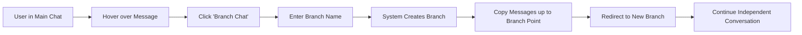
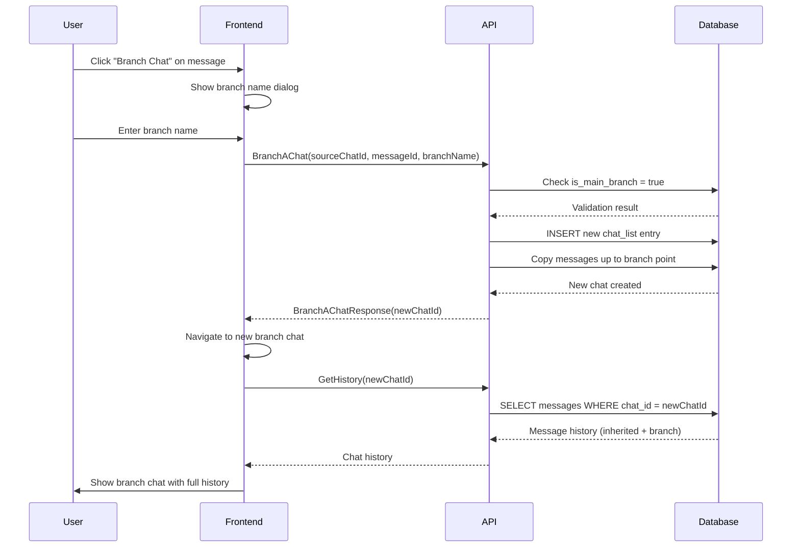

# Chat Branching Design Document

## Overview

Chat branching allows users to create alternate conversation paths from any message in a chat. This enables exploring different conversation directions while preserving the original conversation thread.

## Core Concept

- **Main branch**: Original chat conversation
- **Branch**: New chat starting from a specific message in the main chat
- **No nested branching**: Branches can only be created from main branch chats (for simplicity)
- **Independent evolution**: Each branch evolves independently after creation

## User Experience Flow

### Creating a Branch
1. User is in an existing chat conversation
2. User hovers over any message and sees "Branch Chat" option
3. User clicks "Branch Chat" button
4. System prompts for optional branch name (defaults to "Branch from [original chat name]")
5. System creates new chat with all messages up to the selected message
6. User is redirected to the new branch chat
7. User can continue conversation in the branch independently

### Managing Branches
- **Chat List**: Shows both main chats and branch chats with visual indicators
- **Branch Indicator**: Branch chats show parent relationship (e.g., "↳ Branch from Main Chat")
- **Navigation**: Users can switch between main chat and its branches easily
- **Independence**: Each branch maintains its own conversation history from branch point forward



## Technical Implementation

### Proto Changes

Add new RPC and messages to `proto/chatservice.proto`:

```protobuf
// Add to SortedChat service
rpc BranchAChat(BranchAChatRequest) returns (BranchAChatResponse);

// New messages
message BranchAChatRequest {
  string source_chat_id = 1;           // Chat to branch from
  string branch_from_message_id = 2;    // Message ID where branch starts
  string branch_name = 3;               // Optional name for new branch
  string project_id = 4;                // Project context
}

message BranchAChatResponse {
  string message = 1;                   // Success/error message
  string new_chat_id = 2;              // ID of newly created branch
}

// Extend ChatInfo to show branch information
message ChatInfo {
  string chatId = 1;
  string name = 2;
  string parent_chat_id = 3;           // NEW: Parent chat if this is a branch
  bool is_main_branch = 4;             // NEW: Whether this is a main branch
}
```

### Database Changes

**Migration 8: Add branching support to chat_list table**

```sql
-- 8_chat_branching.up.sql
ALTER TABLE chat_list ADD COLUMN parent_chat_id TEXT;
ALTER TABLE chat_list ADD COLUMN branch_point_message_id TEXT;
ALTER TABLE chat_list ADD COLUMN is_main_branch BOOLEAN DEFAULT TRUE;

-- Index for efficient branch queries
CREATE INDEX IF NOT EXISTS idx_chat_parent ON chat_list(parent_chat_id);
```

**Updated Schema:**
```sql
CREATE TABLE chat_list (
    id INTEGER PRIMARY KEY AUTOINCREMENT,
    chat_id TEXT NOT NULL,
    name TEXT NOT NULL,
    project_id TEXT,
    parent_chat_id TEXT,              -- NEW: Reference to parent chat
    branch_point_message_id TEXT,     -- NEW: Message ID where branch starts
    is_main_branch BOOLEAN DEFAULT TRUE  -- NEW: Main branch flag
);
```

### Database Queries

**Create Branch Chat:**
```sql
-- 1. Insert new chat entry
INSERT INTO chat_list (chat_id, name, project_id, parent_chat_id, branch_point_message_id, is_main_branch)
VALUES (?, ?, ?, ?, ?, FALSE);

-- 2. Copy messages up to branch point
INSERT INTO chat_messages (chat_id, role, content, model, error, input_token_count, output_token_count, created_at)
SELECT ?, role, content, model, error, input_token_count, output_token_count, created_at
FROM chat_messages 
WHERE chat_id = ? AND id <= ?
ORDER BY id;
```

**Prevent Branch of Branch:**
```sql
-- Check if source chat is a main branch before allowing branching
SELECT is_main_branch FROM chat_list WHERE chat_id = ?;
```

**Get Chat List with Branch Info:**
```sql
SELECT chat_id, name, parent_chat_id, is_main_branch, project_id
FROM chat_list 
WHERE project_id = ?
ORDER BY is_main_branch DESC, name ASC;
```

### API Changes

**New DAO Methods:**
```go
// dao.go interface
BranchChat(sourceChatId, branchPointMessageId, newChatId, branchName, projectId string) error
IsMainBranch(chatId string) (bool, error)
```

**New API Implementation:**
```go
// api.go
func (s *Server) BranchAChat(ctx context.Context, req *proto.BranchAChatRequest) (*proto.BranchAChatResponse, error) {
    // 1. Validate source chat is main branch
    isMain, err := s.dao.IsMainBranch(req.SourceChatId)
    if err != nil || !isMain {
        return &proto.BranchAChatResponse{
            Message: "Can only branch from main branch chats",
        }, nil
    }
    
    // 2. Generate new chat ID
    newChatId := generateChatID()
    
    // 3. Create branch
    err = s.dao.BranchChat(req.SourceChatId, req.BranchFromMessageId, newChatId, req.BranchName, req.ProjectId)
    if err != nil {
        return &proto.BranchAChatResponse{
            Message: "Failed to create branch",
        }, nil
    }
    
    return &proto.BranchAChatResponse{
        Message: "Branch created successfully",
        NewChatId: newChatId,
    }, nil
}
```

### Frontend Changes

**UI Components:**
- **Message Actions**: Add "Branch Chat" button/icon to message hover menu
- **Chat List**: Update to show branch hierarchy with visual indicators
- **Branch Modal**: Dialog for entering branch name
- **Navigation**: Breadcrumb or indicator showing current chat's branch status

**State Management:**
```typescript
// store/chat.ts
interface ChatBranch {
  chatId: string;
  name: string;
  parentChatId?: string;
  isMainBranch: boolean;
}

// Add actions
createBranch(sourceChatId: string, messageId: string, branchName: string): Promise<string>
getBranchInfo(chatId: string): ChatBranch | null
```

**New Components:**
- `BranchChatButton.tsx` - Button to trigger branching
- `BranchIndicator.tsx` - Shows if current chat is a branch
- `ChatBranchList.tsx` - Enhanced chat list with branch visualization

## Data Flow Diagram



## Branch Relationship Diagram

```mermaid
graph TD
    M[Main Chat: "Project Discussion"]
    B1[Branch 1: "API Design Focus"]
    B2[Branch 2: "Database Schema Focus"]
    B3[Branch 3: "UI/UX Focus"]
    
    M -.->|Branch at msg 5| B1
    M -.->|Branch at msg 8| B2
    M -.->|Branch at msg 12| B3
    
    M --> M1[Msg 1: Initial idea]
    M --> M2[Msg 2: Requirements]
    M --> M3[Msg 3: Discussion]
    M --> M4[Msg 4: Clarification]
    M --> M5[Msg 5: Architecture]
    
    B1 --> M1
    B1 --> M2
    B1 --> M3
    B1 --> M4
    B1 --> M5
    B1 --> B1_1[Msg 6: API focus]
    B1 --> B1_2[Msg 7: Endpoints]
    
    style M fill:#e1f5fe
    style B1 fill:#f3e5f5
    style B2 fill:#f3e5f5
    style B3 fill:#f3e5f5
```

## Future Enhancements

### Phase 2 Features
- **Branch Merging**: Allow merging insights from branches back to main chat
- **Branch Comparison**: Side-by-side view of different branch conversations
- **Branch Templates**: Predefined branch types (e.g., "Explore Alternative", "Deep Dive")
- **Branch Analytics**: Track which branches are most successful/useful

### Phase 3 Features
- **Collaborative Branching**: Multiple users working on different branches
- **Branch Permissions**: Control who can create/view branches
- **Branch Versioning**: Save snapshots of branches at key points
- **AI-Suggested Branching**: System suggests optimal branch points

### Technical Improvements
- **Lazy Loading**: Load branch history on-demand for performance
- **Branch Archiving**: Archive old/unused branches to reduce clutter
- **Branch Search**: Search across all branches of a chat
- **Export Branches**: Export specific branches or comparisons

### UI/UX Enhancements
- **Visual Branch Tree**: Interactive tree view of all chat branches
- **Branch Notifications**: Notify when branches have new activity
- **Branch Bookmarking**: Mark important branches for quick access
- **Keyboard Shortcuts**: Quick branch creation and navigation

## Implementation Priority

1. **Core Branching** (Week 1-2): Basic branch creation and navigation
2. **UI Polish** (Week 3): Enhanced visual indicators and user experience  
3. **Performance** (Week 4): Optimize queries and loading
4. **Future Features** (Month 2+): Advanced branching capabilities

## Considerations

### Performance
- Branch creation copies messages (storage trade-off for query simplicity)
- Index on `parent_chat_id` for efficient branch queries
- Consider pagination for chats with many branches

### User Experience
- Clear visual distinction between main chats and branches
- Prevent accidental branch creation with confirmation dialogs
- Provide easy navigation between related chats

### Data Integrity
- Enforce business rule: no branches of branches
- Handle edge cases (deleted parent chats, orphaned branches)
- Consider soft delete for branch cleanup