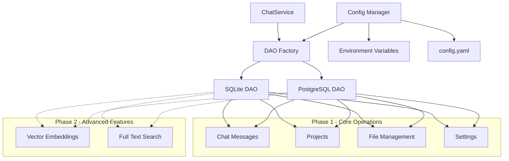

# PostgreSQL Implementation Plan

## Overview
This document outlines the plan to add PostgreSQL support to the SortedChat chatservice while maintaining compatibility with SQLite. The implementation is divided into 2 phases.

## Architecture Overview



## Phase 1: Core Database Operations

### 1.1 Configuration Management

#### 1.1.1 Configuration Structure
```yaml
# config.yaml
database:
  type: "postgres" # or "sqlite"
  sqlite:
    url: "db.sqlite"
  postgres:
    host: "localhost"
    port: 5432
    database: "sortedchat"
    username: "user"
    password: "password"
    ssl_mode: "disable"
    pool:
      max_open_connections: 25
      max_idle_connections: 5
      connection_max_lifetime: "5m"
```

#### 1.1.2 Environment Variables (Fallback)
```bash
DB_TYPE=postgres
POSTGRES_HOST=localhost
POSTGRES_PORT=5432
POSTGRES_DATABASE=sortedchat
POSTGRES_USERNAME=user
POSTGRES_PASSWORD=password
POSTGRES_SSL_MODE=disable
POSTGRES_MAX_OPEN_CONNECTIONS=25
POSTGRES_MAX_IDLE_CONNECTIONS=5
POSTGRES_CONNECTION_MAX_LIFETIME=5m
```

#### 1.1.3 Priority Order
1. config.yaml (highest priority)
2. Environment variables
3. Default values (SQLite)

### 1.2 Database Abstraction Layer

#### 1.2.1 DAO Factory Pattern
```go
type DAOFactory interface {
    CreateDAO() (DAO, error)
    CreateSettingsDAO() (SettingsDAO, error)
}

type SQLiteDAOFactory struct {
    config *Config
}

type PostgresDAOFactory struct {
    config *Config
}
```

### 1.3 PostgreSQL DAO Implementation

#### 1.3.1 New Files Structure
```
backend/chatservice/dao/
├── dao_postgres.go          # PostgreSQL DAO implementation
├── factory.go               # DAO Factory
├── config.go                # Configuration management
└── db/
    └── postgres/
        └── scripts/
            ├── migrations/
            │   └── 1_init.up.sql    # Single migration file with complete schema
            └── seed/
                └── 1_chat_models.up.sql  # Single seed file with all data
```

**Note**: Using single migration and seed file since PostgreSQL is introduced for the first time

#### 1.3.2 PostgreSQL Schema (Phase 1)
Tables to implement:
- `chat_messages` - Core chat functionality
- `chat_list` - Chat metadata
- `model_metadata` - AI model information
- `project` - Project management
- `project_docs` - Document metadata
- `settings` - Application settings
- `rag_chunks` - RAG chunk storage (without vectors)

### 1.4 Connection Management

#### 1.4.1 Connection Pool Configuration
- **Max Open Connections**: 25 (default)
- **Max Idle Connections**: 5 (default)
- **Connection Max Lifetime**: 5 minutes (default)
- **Connection Timeout**: 30 seconds
- **Idle Timeout**: 10 minutes

#### 1.4.2 Health Checks
- Implement connection health check
- Retry logic with exponential backoff
- Graceful degradation strategies

### 1.5 Migration System

#### 1.5.1 Migration Structure
```go
// Use same migration system as SQLite with embedded files
//go:embed db/postgres/scripts/migrations
var postgresMigrationFiles embed.FS

//go:embed db/postgres/scripts/seed
var postgresSeedFiles embed.FS

// Add these functions to migrate.go (same style as SQLite)
func MigratePostgres(dbURL string) error {
	slog.Info("Migrating PostgreSQL database", "dbURL", dbURL)
	sqlDB, err := sql.Open("postgres", dbURL)
	if err != nil {
		slog.Error("error", "err", err)
		return err
	}
	defer sqlDB.Close()

	return MigrateDB_UsingConnection(sqlDB, postgresMigrationFiles, "db/postgres/scripts/migrations", "chatservice_postgres_migrations")
}

func SeedPostgres(dbURL string) error {
	slog.Info("Seeding PostgreSQL database", "dbURL", dbURL)
	sqlDB, err := sql.Open("postgres", dbURL)
	if err != nil {
		slog.Error("error", "err", err)
		return err
	}
	defer sqlDB.Close()

	return MigrateDB_UsingConnection(sqlDB, postgresSeedFiles, "db/postgres/scripts/seed", "chatservice_postgres_seed")
}
```

#### 1.5.2 PostgreSQL Migration Files
- **Single migration file**: `1_init.up.sql` with complete schema (all tables)
- **Single seed file**: `1_chat_models.up.sql` with all initial data
- Use golang-migrate library with postgres driver
- Separate migration table: `chatservice_postgres_migrations`
- **Keep it simple**: Same Go code style as SQLite migration functions

## Phase 2: Vector Embeddings & Full Text Search

### 2.1 Vector Embeddings ⚠️ Phase 2 Only
- Implementation deferred to Phase 2
- Will use pgvector extension (decision pending)
- **Phase 1**: `SaveRAGChunkEmbedding()` and `GetTopSimilarRAGChunks()` will return `errors.New("vector operations not implemented in Phase 1")`

### 2.2 Full Text Search ⚠️ Phase 2 Only  
- Implementation deferred to Phase 2
- Will use PostgreSQL native FTS (decision pending)
- **Phase 1**: `SearchChatMessages()` will return `errors.New("full text search not implemented in Phase 1")`

## Implementation Approaches

### Approach A: Runtime Selection with Factory Pattern (RECOMMENDED)

#### Pros
- Clean separation of concerns
- Easy to test each DAO independently
- Minimal changes to existing service layer
- Can support both databases simultaneously
- Factory pattern allows easy extension for other databases

#### Cons
- Slightly more complex initial setup
- Need to maintain two DAO implementations

#### Implementation Steps
1. Create DAO factory interface
2. Implement PostgreSQL DAO
3. Create configuration management system
4. Update service initialization to use factory
5. Add PostgreSQL migrations
6. Update tests

### Approach B: Database Driver Abstraction

#### Pros
- Unified query interface
- Reduced code duplication
- Single DAO implementation

#### Cons
- More complex to handle database-specific features
- Potential performance implications
- Harder to optimize for specific databases
- Limited flexibility for database-specific optimizations

## Dependencies

### New Dependencies Required
```go
// PostgreSQL driver
"github.com/lib/pq"

// PostgreSQL migration driver (add to existing)
"github.com/golang-migrate/migrate/v4/database/postgres"

// Already available
"github.com/knadh/koanf/v2"
"github.com/golang-migrate/migrate/v4"
```

## File Changes Required

### Phase 1 Files to Create
1. `backend/chatservice/dao/dao_postgres.go`
2. `backend/chatservice/dao/factory.go`
3. `backend/chatservice/dao/config.go`
4. `backend/chatservice/dao/db/postgres/scripts/migrations/1_init.up.sql` (single file)
5. `backend/chatservice/dao/db/postgres/scripts/seed/1_chat_models.up.sql` (single file)
6. `config.yaml` (example configuration)

**Single PostgreSQL Migration File** (`1_init.up.sql`):
- All tables in one file: `chat_messages`, `chat_list`, `model_metadata`, `project`, `project_docs`, `rag_chunks`, `settings`
- Complete schema including indexes, constraints, and triggers
- All user_id columns included from the start
- Chat branching support included

**Single PostgreSQL Seed File** (`1_chat_models.up.sql`):
- All model metadata and initial data in one file
- Combined data from SQLite's `1_chat_models.up.sql` and `2_gpt5.up.sql`

### Phase 1 Files to Modify
1. `backend/chatservice/service/service.go` - Update to use DAO factory
2. `backend/chatservice/api/api.go` - Update initialization
3. `backend/chatservice/settings/settings.go` - Update for database selection
4. `backend/chatservice/go.mod` - Add PostgreSQL driver
5. `backend/mono/main.go` - Update initialization

### Testing Strategy
1. Unit tests for PostgreSQL DAO
2. Integration tests with real PostgreSQL instance
3. Configuration tests for both YAML and env vars
4. Factory pattern tests
5. Migration tests

## Configuration Examples

### config.yaml Example
```yaml
database:
  type: "postgres"
  postgres:
    host: "localhost"
    port: 5432
    database: "sortedchat_dev"
    username: "postgres"
    password: "password"
    ssl_mode: "disable"
    pool:
      max_open_connections: 25
      max_idle_connections: 5
      connection_max_lifetime: "5m"
```

### Docker Compose for Development
```yaml
services:
  postgres:
    image: postgres:15
    environment:
      POSTGRES_DB: sortedchat_dev
      POSTGRES_USER: postgres
      POSTGRES_PASSWORD: password
    ports:
      - "5432:5432"
    volumes:
      - postgres_data:/var/lib/postgresql/data

volumes:
  postgres_data:
```

## Error Handling Strategy

### Connection Failures
- **Fail Fast**: Application should not start if PostgreSQL is configured but unreachable
- **Clear Error Messages**: Provide actionable error messages
- **Configuration Validation**: Validate all required PostgreSQL parameters at startup

### Runtime Errors
- **Transaction Rollback**: Ensure data consistency
- **Retry Logic**: Implement for temporary connection issues
- **Logging**: Comprehensive logging for debugging

## Timeline Estimation

### Phase 1 Implementation
- **Configuration System**: 1-2 days
- **PostgreSQL DAO**: 2-3 days  
- **Factory Pattern**: 1 day
- **Migration System**: 1-2 days
- **Integration & Testing**: 2-3 days
- **Documentation**: 1 day

**Total Phase 1**: 8-12 days

### Phase 2 (Future)
- **Vector Embeddings**: 3-5 days
- **Full Text Search**: 2-3 days
- **Testing & Optimization**: 2-3 days

**Total Phase 2**: 7-11 days

## Success Criteria

### Phase 1
- [ ] PostgreSQL DAO implements all non-vector/FTS methods from DAO interface
- [ ] **Vector/FTS methods return clear error messages** indicating Phase 2 implementation
- [ ] Configuration system works with both YAML and environment variables  
- [ ] Application starts successfully with PostgreSQL configuration
- [ ] All existing SQLite functionality works with PostgreSQL (except vector/FTS)
- [ ] **Single migration file** and **single seed file** create proper PostgreSQL schema
- [ ] Connection pooling works as configured
- [ ] Error handling provides clear messages on configuration/connection issues

### Phase 1 - Non-Implemented Methods (Return Errors)
```go
// These methods will return errors in Phase 1
func (p *PostgresDAO) SaveRAGChunkEmbedding(chunkID string, embedding []float64) error {
    return errors.New("vector embedding operations not implemented in Phase 1 - will be added in Phase 2")
}

func (p *PostgresDAO) GetTopSimilarRAGChunks(userID string, embedding string, projectID string) ([]RAGChunkRow, error) {
    return nil, errors.New("vector similarity search not implemented in Phase 1 - will be added in Phase 2")
}

func (p *PostgresDAO) SearchChatMessages(userID string, query string) ([]proto.SearchResult, error) {
    return nil, errors.New("full text search not implemented in Phase 1 - will be added in Phase 2")
}
```

### Phase 2
- [ ] Vector embeddings work with PostgreSQL
- [ ] Full text search functionality implemented
- [ ] Performance comparable to SQLite implementation
- [ ] All tests pass with both databases

## Notes for Implementation

1. **Memory Management**: PostgreSQL DAO should properly close connections and handle context cancellation
2. **Transaction Management**: Implement proper transaction boundaries for multi-statement operations
3. **Query Optimization**: Use PostgreSQL-specific optimizations where beneficial
4. **Security**: Implement proper SQL injection prevention (sqlx provides this)
5. **Monitoring**: Add metrics for connection pool usage and query performance

---

**Decision Point**: Choose Approach A (Factory Pattern) for implementation.

**Next Steps**: 
1. Implement configuration system using koanf
2. Create DAO factory pattern
3. Implement PostgreSQL DAO for Phase 1 operations
4. Add migration and seed scripts
5. Update service initialization
